## EN:

# Help Desk Project

## Overview

This project builds a simple Technical Support Portal (Help Desk) using 

* Node.js, 
* Express, 
* MongoDB and 
* Handlebars.

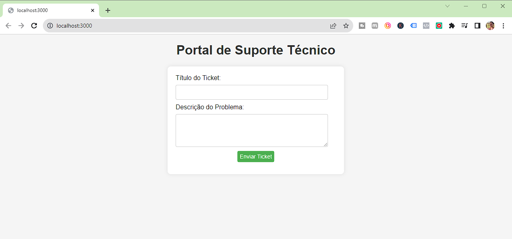

## Installation and Setup

1. Ensure Node.js is installed on your machine. You can download it from [Node.js official website](https://nodejs.org/).
2. Install MongoDB on your machine if it isn't already installed. You can download it from [MongoDB official website](https://www.mongodb.com/try/download/community). Installation instructions can be found on the [MongoDB documentation page](https://docs.mongodb.com/manual/installation/).
3. Remember to enable the Install MongoDB Compass option to install the Graphical User Interface (GUI) version of MongoDB.
4. To verify if the server is truly installed and running, search for MongoDB in Services and it will be running.

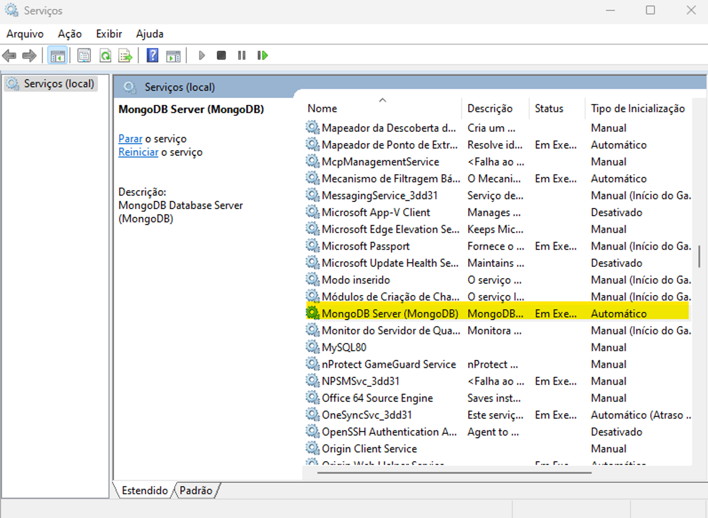 

5. The default port will be 27017.

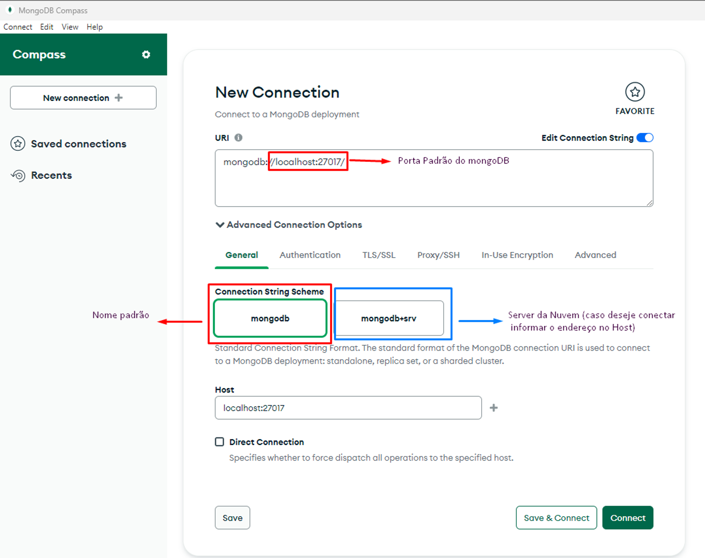 

6. Automatically, 3 databases are created: admin, config and local.

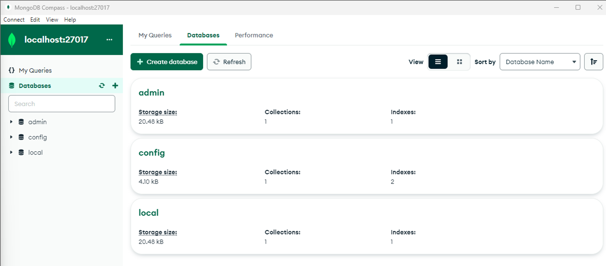 

## Project Creation

1. Create a new directory for your project in the desired location.
	
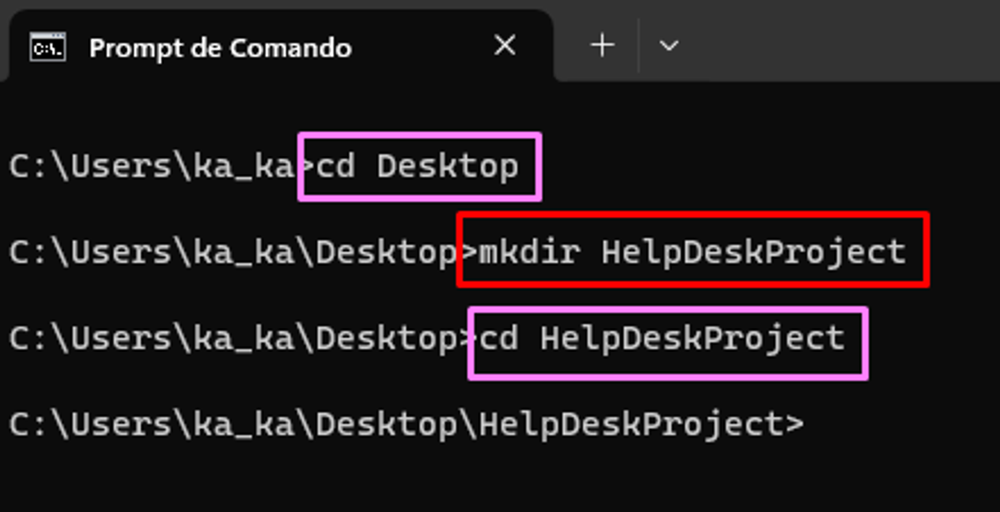 

2. Initialize a new Node.js project in this directory by running `npm init -y` in your terminal.

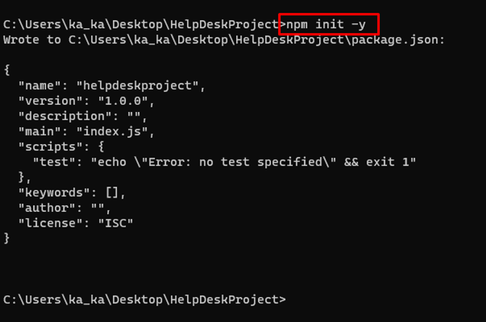 

3. Install the necessary dependencies by running `npm install express mongoose express-handlebars` in your terminal.

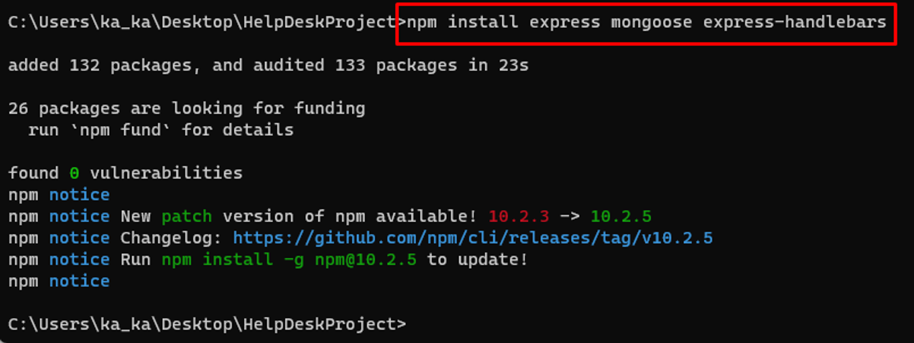 

## Project Files

1. Create a new directory named 'views' within your project directory.

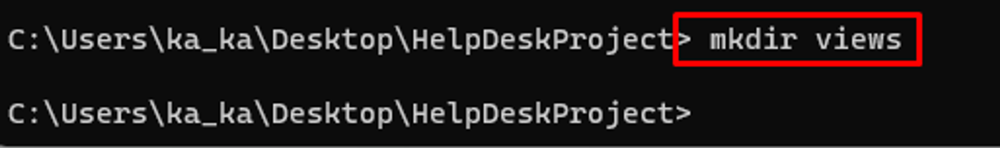 

2. Create new .handlebars files in the 'views' directory for your HTML templates.

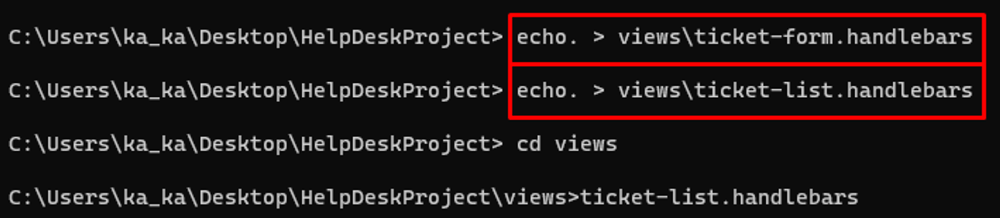 

3. Create a new file named 'app.js' in the main project directory.

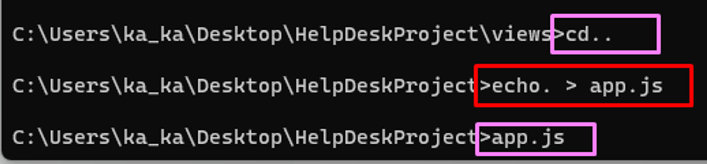 

4. Open 'app.js' in a text editor and add the following code to configure Express and Handlebars:

```jsx
const express = require('express');
const exphbs = require('express-handlebars');
const app = express();
const PORT = process.env.PORT || 3000;

app.engine('handlebars', exphbs());
app.set('view engine', 'handlebars');
app.use(express.urlencoded({ extended: true }));

```

## Running the Application

1. Start the application by running `node app.js` in your terminal.

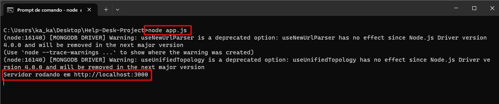 

2. Open a web browser and navigate to `http://localhost:3000` to view the application.

## Sources

* How to install MongoDB (2022) PT-BR: [YouTube](https://www.youtube.com/watch?v=l4HeaNRi8f8).
* [Node.js official website](https://nodejs.org/).
* [MongoDB official website](https://www.mongodb.com/try/download/community).

## PT-BR:

Portal de Suporte T�cnico (Help Desk) usando:
* Node.js, 
* Express, 
* MongoDB and 
* Handlebars.


Passo 1: Configura��o do Ambiente

1.1. Certifique-se de ter o Node.js instalado em sua m�quina. Voc� pode baix�-lo em https://nodejs.org/.

1.2. Instale o MongoDB em sua m�quina, se ainda n�o estiver instalado https://www.mongodb.com/try/download/community. Voc� pode encontrar instru��es de instala��o em https://docs.mongodb.com/manual/installation/.

Fonte: https://www.youtube.com/watch?v=l4HeaNRi8f8

1.3. Lembre-se de habilitar a op��o Install MongoDB Compass para que seja instalada a vers�o Graphical User Interface (GUI) do MongoDB.

1.4. Para verificar se o Server foi realmente instalado e est� em execu��o, buscar por MongoDB em Servi�os e ele estar� em execu��o:

 

1.5. A porta padr�o ser� a 27017, clicar em Connect:

 

1.6. Automaticamente s�o criados 3 bancos de dados o admin, o config e local:

 

2.0. Cria��o da Pasta de Trabalho:

2.1. Na barra de pesquisa do Windows pesquisar por CMD e ir� abrir o prompt de comando;

2.2. O comando CD + TAB ir� alternar entre as pastas que j� est�o criadas no C:\Users\seu_usuario_windows>cd pastas (no caso escolhi a pasta Desktop) + enter

2.3. Dentro da pasta desejada acionar o comando MKDIR + Nome_da_sua_pasta para criar uma nova pasta;

2.4. Acionar novamente o comando cd + Nome_da_sua_pasta para entrarmos nesta nova pasta:

 

3.0. Cria��o do novo projeto Node.js e instalar as depend�ncias necess�rias:

3.1. Utilizar o comando npm init -y

 

3.2. Utilizar o comando: npm install express mongoose express-handlebars

 

4.0. Cria��o dos Arquivos do Projeto

4.1. Crie uma pasta chamada views dentro do diret�rio do seu projeto:

 

4.2. Com o comando echo criaremos os arquivos com a extens�o .handlebars, que � comumente usada para arquivos de modelo HTML quando voc� est� trabalhando com o mecanismo de modelo Handlebars no Node.js.

 

OBS.: com o comando cd na pasta views conseguimos visualizar os arquivos criados.

4.3. Com o comando cd.. vamos descer um n�vel de diret�rio e retornar ao diret�rio principal HelpDeskProject e criar o arquivo .js com o comando echo. > app.js:

 

OBS.: Para confirmar se o arquivo foi criado, pressione a tecla TAB at� que o arquivo seja exibido.

5.0. Configura��o do Express e Handlebars

5.1. Abra o arquivo app.js em um editor de texto simples, como o Bloco de Notas ou Visual Studio Code, no meu caso estou utilizando o Microsoft Visual Studio Community 2022 (64 bits) - Vers�o 17.5.2

5.2. Adicione o seguinte c�digo no arquivo para configurar o Express e Handlebars:

```jsx
const express = require('express');
const exphbs = require('express-handlebars');
const app = express();
const PORT = process.env.PORT || 3000;

app.engine('handlebars', exphbs());
app.set('view engine', 'handlebars');
app.use(express.urlencoded({ extended: true }));

```
## Executando a Aplica��o:

1. No prompt de comando executar: `node app.js`.

 

2. Abra o navegador no endere�o `http://localhost:3000` para ver a aplica��o.

## Fontes:

* Como instalar o MongoDB (2022) PT-BR: [YouTube](https://www.youtube.com/watch?v=l4HeaNRi8f8).
* Site oficial do Node.js [Node.js official website](https://nodejs.org/).
* Site oficial do MongoDB [MongoDB official website](https://www.mongodb.com/try/download/community).
